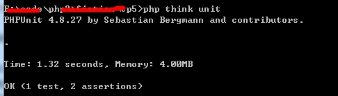

# 使用composer安装ThinkPHP

* * * * *
在官方手册中，有三种方法可以下载安装thinkphp 5.x。分别是

1. 直接从官方网站下载
2. 使用git进行下载
3. 使用composer进行安装。

在这里推荐使用第三种，即使用composer进行安装。

## 使用composer进行安装

1. 安装composer

window下直接使用composer的安装程序，下面是下载链接：
[点击下载window下的composer安装程序](https://getcomposer.org/Composer-Setup.exe)

 类linux下的话直接使用下面命令进行安装：

 ~~~
 curl -sS https://getcomposer.org/installer | php mv composer.phar /usr/local/bin/composer
 ~~~
 
2. 下载ThinkPHP

 ~~~
 composer create-project topthink/think tp5  --prefer-dist
 ~~~

3. 安装单元测试扩展

到了这一步，我们的ThinkPHP已经下载好了，接下来就是下载ThinkPHP的单元测试扩展了。

 `composer require topthink/think-testing`
 
 这一过程会比较慢，因为PHPUNIT依赖的包比较多，所以下载的时间比较慢。

 > 前一步创建的目录是tp5，因此需要切换到tp5目录下运行这一条指令哦。 
 >
 > linux: cd tp5 
 >
 > windows: cd tp5

4. 进行单元测试

进行上面的那些步骤之后，在tp5目录下，就会多出一个tests的目录和phpunit.xml的文件了。然后我们再运行下面的命令，测试一下安装是否成功：

 `php think unit`

 如果出现下面的信息，则说明安装成功：
 
  
  
到了这里，你的环境以及配置成功，可以进行下一步了。