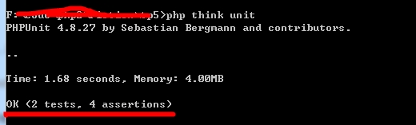

# 编写一个操作

* * * * *

首次运行ThinkPHP之后，都会默认创建一个Index模块，Index控制器和一个index的操作。
接下来的这个实例，我们就是要在Index控制器中添加一个test的操作，在这个操作中，我们输出一段字符串：`hello world`。然后在测试用例中对这个字符串进行断言。

1. 新建一个test的操作

首先在路径tp5/application/index/controller/Index.php中新建一个test的操作：

 ~~~
 <?php
 namespace app\index\controller;
 
 class Index
 {
    public function index()
    {
       ...
    }
	
	public function test(){
		return 'Hello world!';
	}
 }
 ~~~

 上面这段代码的主要功能就是输出一段`Hello world!`的字符串。在浏览器中的路径通常是：
 
 `http://127.0.0.1/tp5/public/index.php/index/index/test`
 
 结果是在网页中显示一段字符串Hello world!。注意，该路径可能在不同配置下有所不同，请注意更改。

 > 安全提示：官方建议的根目录应该为public，在这里因为我本地测试项目比较多，因此本项目只是一个子项目，没有设置public为根目录。请不要在生产环境上使用类似上面的路径。
 > 
 > 并且因为测试框架是模拟请求，因此是不用搭建服务器的。
 
2. 新建一个测试用例类

在tests目录下新建一个IndexTest.php的测试用例类，并在其中键入一下的代码：
 
 ~~~
 <?php
 namespace tests;
 
 class IndexTest extends TestCase
 {
 
    public function testTest()
    {
        $this->visit('/index/index/test')->see('Hello world!');
    }
 }
 ~~~

 > 如果直接复制上面代码，请注意缩进的问题和编码问题。否则运行过程中可能会报错。
 
 该测试用例是继承ThinkPHP单元测试扩展类TestCase的。该类提供了多个用于支持ThinkPHP进行单元测试的方法。
 
 其中，visit方法是接受一个作为URI的参数模拟向ThinkPHP框架中的某个测试发起请求。
 
 而see方法则是断言输出的结果是否符合一个正则表达式，其中第一个参数为要匹配的正则表达式，第二个参数的值为true时断言正则表达式不出现在结果中，为false时断言正则表达式出现在结果中，默认为false。

3. 运行测试

输入一下命令，进行测试：
 
 `php think unit`
 
 这条命令需要在ThinkPHP根目录下运行，在本文档中是tp5目录下运行。当在使用命令的时候，需要切换到该目录中来。
 think是在ThinkPHP目录下的一个PHP文件，当运行这条命令的时候，实际上会执行think文件的。
 
 这个时候运行结果会是：

 
 
 在结果的最后一行中，显示OK，说明所有的测试用例都测试通过了，在括号中的内容是表示有2个测试用例类，4个断言被测试了。

 > 这里之所以有`2 tests`是因为tests目录下还有一个`ExampleTest.php`的测试类。
 > 
 > 而`4 assertions`则表明是有四个测试用例。当我们把
 >
 > `$this->visit('/index/index/test')->see('Hello world!');`
 >
 > 修改成
 >
 > `$this->visit('/index/index/test');`
 >
 > 可以发现，现在的assertions只剩下三个了。因此，可以得知visit内部也有断言。
 >
 > $this->assertEquals(200, $status);
 >
 > 主要是对网页请求的状态码进行断言。

